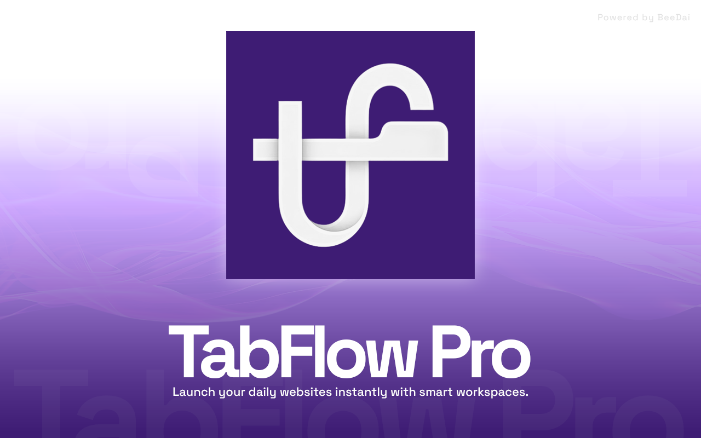
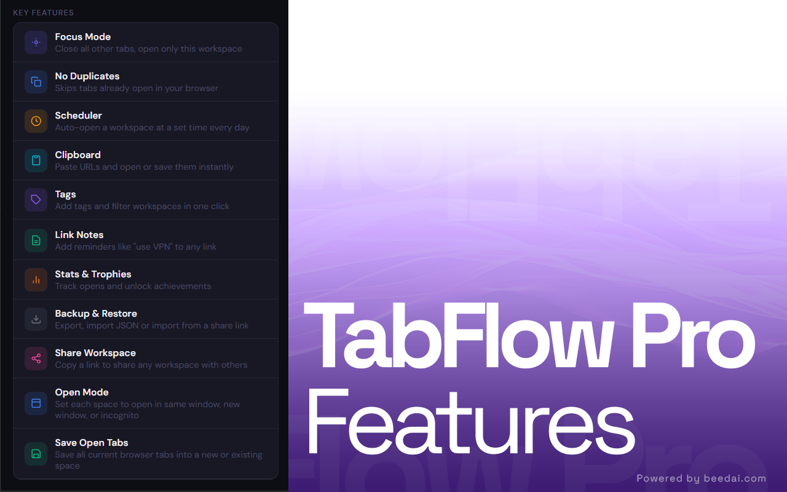
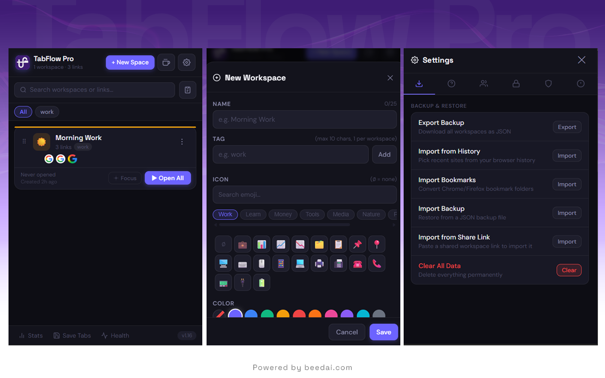

# TabFlow Pro

### Smart browser workspace manager built for people who live with too many tabs open 🚀

A clean, modern browser extension to organize, save, restore, and automate your browsing workflow.

  
  

---

## ✨ Why TabFlow Pro?

I built TabFlow Pro because existing tab managers felt too bloated, outdated, or didn’t match how I actually work.

TabFlow Pro focuses on speed, simplicity, automation, and productivity.

---

## 🚀 Features

✅ Focus Mode  
Close distractions and open only the workspace you need.

✅ No Duplicate Tabs  
Avoid opening tabs you already have open.

✅ Scheduler  
Automatically open your daily workspace at the exact time you want.

✅ Clipboard Import  
Paste multiple URLs and instantly save/open them.

✅ Tags & Filters  
Organize workspaces without chaos.

✅ Link Notes  
Add reminders to saved links.

✅ Backup & Restore  
Export/import your workspaces anytime.

✅ Share Workspace  
Share a full workspace with one click.

✅ Open Modes  
Open in same window, new window, or incognito.

✅ Save Open Tabs  
Instantly save your current browser session.

---

## 📸 Screenshots

  

---

## 📦 Install

- [Chrome Web Store](coming soon)
- [Firefox Add-ons](https://addons.mozilla.org/en-GB/firefox/addon/tabflow-pro/)

---

## ❤️ Built for productivity nerds
If your browser constantly has 20–100 tabs open… this is for you 😄
